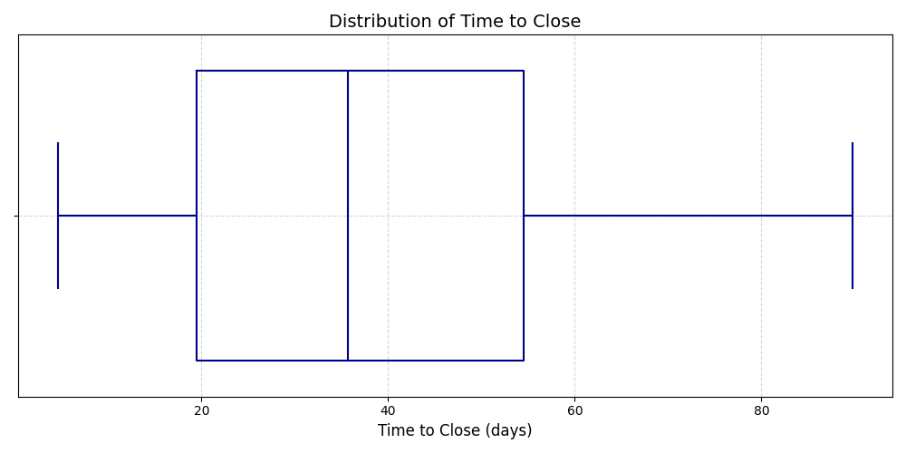
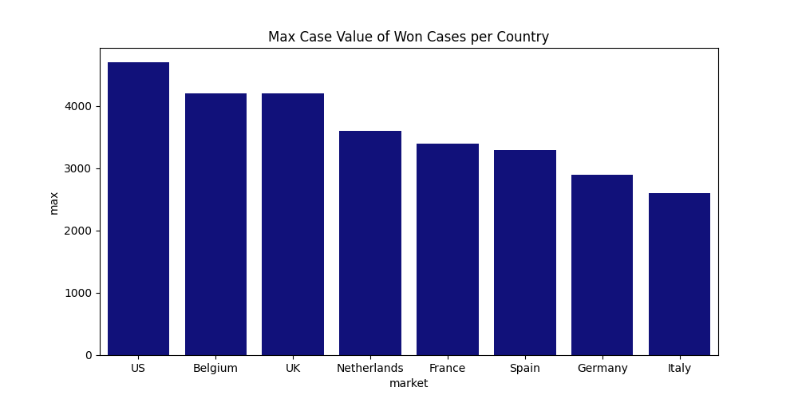

# CABIChallenge

 ## Question 1

 ### Sub question 1
 Avg. resolution time is 1 month and 8 days (rounded down to days)
 

 ### Sub question 2
 The Max Case cost of a won case is 4700, however these vary greatly depending on the market as seen in the visualization

 

 ## Question 2

 ### Sub question 1
|client_id|client_name   |client_value|cltv_group|
|---------|--------------|------------|----------|
|C100     |Belgu         |19200       |High      |
|C102     |AFK           |10000       |High      |
|C111     |Gett-E        |9200        |High      |
|C103     |D-PAH         |8500        |High      |
|C104     |PA-tato       |8400        |Medium    |
|C110     |Routers       |8000        |Medium    |
|C101     |NPC           |7200        |Medium    |
|C105     |EFFES         |6600        |Medium    |
|C106     |AN-SAW        |5000        |Low       |
|C108     |Photo-Newsy   |4600        |Low       |
|C109     |NPC-Freelancey|3500        |Low       |
|C107     |E-PAW         |3250        |Low       |

 
 ### Sub question 2
 The exponential weighted average for each of the clients are calculated for each of the clients. This ensures that the value of the most recent case is weighted higher than the older ones, this would most likely be more usefull from a business context, as I assume clients budgets and demands are heavily temporal. 
 
The formula for doing so is given by: 
 
$$\text{EWA} = \frac{\sum_{i=1}^n x_i \cdot e^{-\lambda (i - 1)}}{\sum_{i=1}^n e^{-\lambda (i - 1)}}$$

Where we set $\alpha=0.5$ for this case, $x_i$ is the case value for the corresponding rank $i$

|client_id|client_name   |weighted_avg_case_value|
|---------|--------------|-----------------------|
|C111     |Gett-E        |4624.49                |
|C104     |PA-tato       |4200.00                |
|C110     |Routers       |3987.75                |
|C100     |Belgu         |3788.07                |
|C101     |NPC           |3600.00                |
|C109     |NPC-Freelancey|3500.00                |
|C102     |AFK           |3338.56                |
|C105     |EFFES         |3300.00                |
|C107     |E-PAW         |3250.00                |
|C103     |D-PAH         |2850.65                |
|C106     |AN-SAW        |2524.49                |
|C108     |Photo-Newsy   |2324.49                |

## Question 3
For this task I decided to look at the market trend as the avg. pct. growth over the period for each market and for each status. This should provide value as to which markets have been growing in revenue based on the value. It is calculated by grouping by each year-month and then summing the value for each month. Then for each month the pct. difference from the previous month is calculated, lastly these are then aggregated in to single averages for each market and status. The same is done for the number cases. 

** Note ** if the total cases is 1 then the pct. growth will also be NULL since there is nothing to compare against. 

|market     |status|avg_monthly_pct_growth_value|avg_monthly_pct_growth_count|total_cases|
|-----------|------|----------------------------|----------------------------|-----------|
|Belgium    |Lost  |-46.0                       |-50.0                       |3          |
|Belgium    |Open  |-8.6                        |-25.0                       |4          |
|Belgium    |Won   |35.4                        |62.5                        |8          |
|France     |Lost  |NULL                        |NULL                        |1          |
|France     |Open  |6.5                         |0.0                         |2          |
|France     |Won   |0.2                         |0.0                         |3          |
|Germany    |Lost  |NULL                        |NULL                        |1          |
|Germany    |Open  |7.4                         |0.0                         |2          |
|Germany    |Won   |-1.7                        |0.0                         |3          |
|Italy      |Lost  |-2.0                        |0.0                         |2          |
|Italy      |Open  |NULL                        |NULL                        |1          |
|Italy      |Won   |8.3                         |0.0                         |2          |
|Netherlands|Lost  |-20.9                       |-33.3                       |5          |
|Netherlands|Open  |NULL                        |NULL                        |2          |
|Netherlands|Won   |-49.3                       |-50.0                       |3          |
|Spain      |Lost  |0.0                         |0.0                         |2          |
|Spain      |Open  |NULL                        |NULL                        |1          |
|Spain      |Won   |0.0                         |0.0                         |2          |
|UK         |Lost  |90.2                        |100.0                       |3          |
|UK         |Open  |93.8                        |100.0                       |3          |
|UK         |Won   |48.9                        |50.0                        |4          |
|US         |Lost  |NULL                        |NULL                        |1          |
|US         |Open  |NULL                        |NULL                        |1          |
|US         |Won   |4.4                         |0.0                         |2          |

## Question 4

### Sub Question 1
For identifying the best performing agent each, the won, lost and total cases are queried for allong with the win frequency and avg. resolve time. 

As can be seen in the table below user_1 is the agent with te highest win frequency, but is also $\approx 10$ days slower than user_2 who almost achieves the same win frequency.  

|assigned_to|won_cases_count|lost_cases_count|total_cases_count|win_frequency|avg_resolve_time             |
|-----------|---------------|----------------|-----------------|-------------|-----------------------------|
|user_3     |8              |7               |20               |0.40         |1 mon 6 days 10:49:04.674261 |
|user_1     |10             |4               |21               |0.48         |1 mon 14 days 14:13:19.001284|
|user_2     |9              |7               |20               |0.45         |1 mon 4 days 14:44:58.105442 |

### Sub Question 2
For the next table, we identify how the agents have performed over time. From the table below it is evident that user_1 regardning the win frequency, is generally stable around the 0.5 mark over the past 3 months. user_2 on the other hand has dropped quite significantly in win frequency, while user three has seen a great improvement. This is also a great insight regarding the top table, as it shows that user three could be expected to also stabilize around the 0.5 mark over the comming months (this could indicate user_3 could be a new agent).

|assigned_to|month_year|won_cases|lost_cases|total_cases|win_frequency|avg_resolve_time             |
|-----------|----------|---------|----------|-----------|-------------|-----------------------------|
|user_1     |01-2024   |4        |2         |10         |0.40         |1 mon 15 days 23:29:09.16925 |
|user_1     |02-2024   |3        |1         |5          |0.60         |1 mon 27 days 19:15:06.698532|
|user_1     |03-2024   |3        |1         |6          |0.50         |29 days 07:17:46.052087      |
|user_2     |01-2024   |4        |2         |6          |0.67         |1 mon 10 days 08:47:56.734037|
|user_2     |02-2024   |3        |3         |9          |0.33         |1 mon 1 day 22:46:39.098072  |
|user_2     |03-2024   |2        |2         |5          |0.40         |29 days 23:37:58.673606      |
|user_3     |01-2024   |1        |2         |4          |0.25         |1 mon 2 days 19:03:17.708152 |
|user_3     |02-2024   |2        |3         |7          |0.29         |1 mon 13 days 12:20:44.622802|
|user_3     |03-2024   |5        |2         |9          |0.56         |1 mon 2 days 23:20:21.982207 |

 
